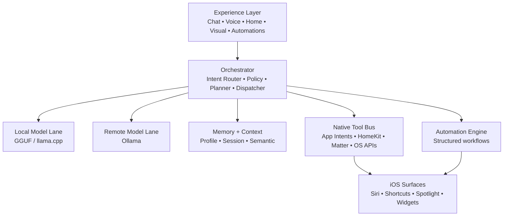
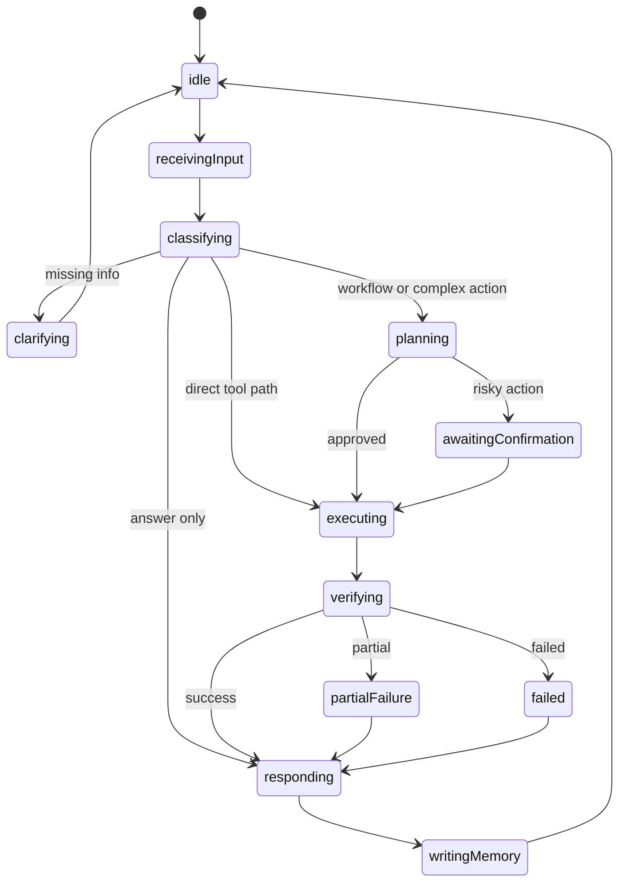

# JARVIS vNext: iPhone Agent Runtime Engineering Spec

## Purpose
This document turns the proposed iPhone-first JARVIS architecture into a repo-grounded implementation spec.

It is intentionally opinionated:
- the model does not execute native actions directly
- the orchestrator remains the control plane
- execution happens through typed native adapters
- local inference and remote inference are separate lanes
- automation is stored as structured workflows, not re-evaluated natural language

This spec is designed to fit the current `JarvisIOS` codebase and the thread ownership model already in use.

## Non-Goals
This spec does not define:
- llama.cpp internals
- decoding policy
- KV cache strategy
- low-level runtime optimizations
- a full visual redesign

Those remain outside this document.

## Current Codebase Fit
Existing iOS seams already present in the repo:
- app shell and route owner: `JarvisIOS/JarvisPhoneAppModel.swift`
- assistant control plane: `JarvisIOS/Shared/Assistant/JarvisTaskOrchestrator.swift`
- runtime boundary: `JarvisIOS/Shared/Runtime/JarvisLocalModelRuntime.swift`
- local/remote backend config: `JarvisIOS/Shared/Settings/JarvisAssistantSettings.swift`
- app entry contracts: `JarvisIOS/Shared/Launch/JarvisLaunchRoute.swift`
- App Intents / Shortcuts: `JarvisIOS/Intents/JarvisPhoneShortcuts.swift`
- memory and context: `JarvisIOS/Shared/Assistant/*Memory*`, `ConversationMemoryManager.swift`
- structured output formatting: `JarvisIOS/Shared/Assistant/JarvisAssistantOutput*.swift`

The vNext work should extend these seams instead of creating parallel systems.

## Target Runtime Architecture



## Core Principle
All action-oriented requests follow this contract:
1. user input enters as voice/text
2. input is normalized
3. intent is classified into a typed contract
4. policy validates the action
5. planner chooses either direct execution or a multi-step workflow
6. dispatcher invokes typed tools
7. verifier confirms result status
8. memory and session history are updated
9. UI presents result and next actions

The LLM may suggest an intent. It never executes the action directly.

## Module Map

### 1. Experience Layer
Location:
- `JarvisIOS/Views`
- `JarvisIOS/Views/Modern`
- `JarvisIOS/JarvisPhoneAppModel.swift`

Responsibilities:
- render assistant state
- collect user input
- stream partial output
- show execution progress
- render structured cards
- show automation and home-control surfaces

Hard rules:
- inference never blocks main thread
- tool execution results are displayed from typed state, not inferred from free text
- long-running work must have explicit progress state

### 2. Orchestrator Layer
Location to use/extend:
- `JarvisIOS/Shared/Assistant/JarvisTaskOrchestrator.swift`
- `JarvisIOS/Shared/Assistant/JarvisAssistantOrchestrationModels.swift`

New submodules to add:
- `JarvisIntentRouter.swift`
- `JarvisPolicyEngine.swift`
- `JarvisExecutionPlanner.swift` only if extending existing planner, not replacing ownership
- `JarvisToolDispatcher.swift`
- `JarvisResultVerifier.swift`
- `JarvisConversationManager.swift`

Responsibilities:
- route request to answer vs action vs clarification vs workflow
- choose local vs remote model lane
- attach task-aware context packet
- validate permissions and policy
- produce a typed execution plan
- dispatch tool calls and collect results

### 3. Model Layer
Location to use/extend:
- `JarvisIOS/Shared/Runtime`

Submodules:
- `JarvisModelRouter.swift`
- `JarvisLocalModelRuntime.swift` existing
- `JarvisOllamaRemoteEngine.swift` existing remote engine
- `JarvisPromptBlueprintFactory.swift`
- `JarvisSchemaValidator.swift`

Responsibilities:
- choose local or remote inference lane
- run schema-oriented classification prompts
- run conversation prompts
- run planning prompts only when needed

Routing policy v1:
- local lane for:
  - direct action classification
  - parameter extraction
  - short responses
  - offline fallback
- remote lane for:
  - complex planning
  - long-context reasoning
  - multi-step workflows
  - low-confidence escalation

### 4. Memory + Context Layer
Location to use/extend:
- `JarvisIOS/Shared/Assistant/JarvisMemoryModels.swift`
- `JarvisIOS/Shared/Assistant/JarvisMemoryStore.swift`
- `JarvisIOS/Shared/Assistant/ConversationMemoryManager.swift`
- `JarvisIOS/Shared/Assistant/JarvisSemanticMemoryProvider.swift`

New submodules:
- `JarvisProfileStore.swift`
- `JarvisSessionStore.swift`
- `JarvisSemanticStore.swift`
- `JarvisHomeGraphStore.swift`
- `JarvisExecutionHistoryStore.swift`

Memory classes:
- Profile memory
- Environment memory
- Session memory
- Semantic memory

Responsibilities:
- stable user preferences
- current session and task continuity
- home/accessory graph
- execution history
- compact context packing for orchestrator

### 5. Native Tool Bus
New directory:
- `JarvisIOS/Shared/Tools`

Suggested structure:
- `ToolRegistry.swift`
- `ToolProtocols.swift`
- `Native/`
- `Home/`
- `Automation/`
- `Bridges/`

Typed adapters:
- `JarvisHomeToolAdapter.swift`
- `JarvisShortcutToolAdapter.swift`
- `JarvisNotificationToolAdapter.swift`
- `JarvisLocalAuthToolAdapter.swift`
- `JarvisAppNavigationToolAdapter.swift`

Responsibilities:
- translate typed invocation into real iOS/HomeKit/Shortcut execution
- report structured success/failure
- enforce tool metadata constraints

### 6. Automation Engine
New directory:
- `JarvisIOS/Shared/Automation`

Files:
- `JarvisAutomationEngine.swift`
- `JarvisAutomationModels.swift`
- `JarvisTriggerEvaluator.swift`
- `JarvisConditionResolver.swift`
- `JarvisWorkflowExecutor.swift`
- `JarvisRetryQueue.swift`
- `JarvisExecutionLedger.swift`

Responsibilities:
- store structured workflows
- evaluate triggers and conditions
- execute typed workflow steps
- retry and log
- surface results back into UI and memory

## Protocol Map

### Intent and Planning
```swift
protocol JarvisIntentClassifying {
    func classify(_ input: JarvisUserInput, context: JarvisRoutingContext) async throws -> JarvisTypedIntent
}

protocol JarvisIntentRouting {
    func route(_ intent: JarvisTypedIntent, context: JarvisExecutionContext) async throws -> JarvisRouteDecision
}

protocol JarvisPlanning {
    func plan(for decision: JarvisRouteDecision, context: JarvisExecutionContext) async throws -> JarvisExecutionPlan
}
```

### Models
```swift
protocol JarvisModelRouting {
    func lane(for intent: JarvisTypedIntent, context: JarvisExecutionContext) -> JarvisModelLane
}

protocol JarvisSchemaGenerating {
    func generateIntent(from input: JarvisUserInput, schema: JarvisIntentSchema) async throws -> JarvisTypedIntent
}
```

### Memory
```swift
protocol JarvisMemoryProviding {
    func contextPacket(for intent: JarvisTypedIntent, conversationID: UUID?) async -> JarvisContextPacket
}

protocol JarvisMemoryWriting {
    func record(_ event: JarvisMemoryEvent) async
}

protocol JarvisSummaryGenerating {
    func summarize(session: JarvisConversationRecord) async -> JarvisConversationSummary
}
```

### Tools
```swift
protocol JarvisTool {
    var id: String { get }
    var risk: JarvisRiskLevel { get }
    var backgroundPolicy: JarvisBackgroundPolicy { get }
    func execute(_ invocation: JarvisToolInvocation) async throws -> JarvisToolResult
}

protocol JarvisToolRegistryProviding {
    func tool(for id: String) -> JarvisTool?
    func capabilities() -> [JarvisToolCapability]
}
```

### Automation
```swift
protocol JarvisAutomationRunning {
    func run(_ workflow: JarvisAutomationWorkflow) async -> JarvisAutomationRunResult
}

protocol JarvisTriggerEvaluating {
    func shouldFire(_ trigger: JarvisAutomationTrigger, now: Date) async -> Bool
}
```

## Core Data Contracts

### Typed Intent
```swift
struct JarvisTypedIntent: Codable, Equatable {
    var mode: JarvisIntentMode
    var intent: String
    var confidence: Double
    var arguments: [String: JarvisIntentValue]
    var requiresConfirmation: Bool
    var reasoningSummary: String
}
```

Allowed modes:
- `respond`
- `action`
- `clarify`
- `workflow`

### Execution Plan
```swift
struct JarvisExecutionPlan: Codable, Equatable {
    var id: UUID
    var selectedSkillID: String?
    var lane: JarvisModelLane
    var steps: [JarvisExecutionStep]
    var requiresConfirmation: Bool
    var fallbackBehavior: JarvisFallbackBehavior
}
```

### Tool Invocation
```swift
struct JarvisToolInvocation: Codable, Equatable {
    var toolID: String
    var arguments: [String: JarvisIntentValue]
    var sourceIntent: JarvisTypedIntent
    var authContext: JarvisAuthorizationContext
}
```

### Tool Result
```swift
struct JarvisToolResult: Codable, Equatable {
    var status: JarvisExecutionStatus
    var userMessage: String
    var rawResult: Data?
    var retryable: Bool
    var verificationState: JarvisVerificationState
}
```

## Execution State Machine



### State Rules
- `classifying` may use local model only.
- `planning` may escalate to Ollama.
- `executing` never calls the model except for optional reflection/repair.
- `verifying` must use typed tool results first, not free-text inference.
- `writingMemory` is asynchronous and never blocks UI completion.

## Context Assembly Policy

### Working Memory
Sources:
- last 8 to 12 messages
- current tool outputs
- active workflow step

### Session Memory
Sources:
- conversation summary
- key goals
- unresolved follow-ups
- assistant actions already taken

### Long-Term Memory
Sources:
- stable preferences
- project facts
- home topology
- recurring workflows

### Packing Rules
- hard budget target: 150 to 250 tokens of injected context for routing/classification
- action mode gets compact environment and permission context only
- planning mode gets goals, constraints, and open tasks
- knowledge mode prefers saved knowledge and topic summaries
- drafting mode prefers tone, recipient, and style preferences

## Assistant Skill Map
This is a shaping layer, not a tool-calling layer.

Initial skills:
- `answer_question`
- `knowledge_lookup`
- `code_generation`
- `code_explanation`
- `draft_email`
- `draft_message`
- `planning`
- `summarization`
- `rewrite_text`
- `brainstorm`
- `home_control`
- `automation_creation`

Each skill should declare:
- supported intent categories
- preferred context sources
- preferred output card type
- follow-up hint set

## Structured Output Policy
Structured cards remain additive to plain text.

Allowed output surfaces:
- plain response
- draft card
- code answer card
- checklist / plan card
- knowledge answer card
- clarification card
- pros/cons card
- brainstorm card
- automation summary card
- execution result card

Qualification rule:
- content must qualify on its own
- request type alone is not enough
- action results should prefer execution result cards over generic prose

## Native Tool Bus Design

### Tool Metadata
Each tool must define:
- `id`
- `displayName`
- `capability`
- `riskLevel`
- `requiresBiometricAuth`
- `backgroundEligible`
- `lockScreenEligible`
- `auditCategory`

### Initial Tool Families
- app navigation
- notifications/reminders/calendar where app-owned or officially exposed
- HomeKit control
- Matter onboarding/access bridge
- shortcut bridge
- chat vault auth gate
- automation CRUD

### Explicit Non-Goals
No generic “control any app on iPhone” adapter.
Only use:
- App Intents
- App Shortcuts
- HomeKit
- MatterSupport
- supported OS APIs
- explicit vendor APIs if later added

## Automation Engine

### Workflow Schema
```swift
struct JarvisAutomationWorkflow: Codable, Equatable, Identifiable {
    var id: UUID
    var name: String
    var trigger: JarvisAutomationTrigger
    var conditions: [JarvisAutomationCondition]
    var steps: [JarvisAutomationStep]
    var failurePolicy: JarvisAutomationFailurePolicy
    var notificationPolicy: JarvisAutomationNotificationPolicy
    var isEnabled: Bool
}
```

### Trigger Types v1
- schedule
- app shortcut invocation
- home event
- location arrival/departure if supported by approved surface
- focus mode bridge if later supported
- manual run

### Design Rule
Natural language is only used at creation/edit time.
Execution always uses the stored structured workflow.

## Storage Schema
Use SQLite for typed state. Keep encryption/key management separate.

### Tables

#### `assistant_profile`
- `id TEXT PRIMARY KEY`
- `preferred_name TEXT`
- `timezone_identifier TEXT`
- `notification_preference_json BLOB`
- `security_policy_json BLOB`
- `updated_at REAL`

#### `assistant_memory`
- `id TEXT PRIMARY KEY`
- `kind TEXT NOT NULL`
- `title TEXT`
- `content TEXT NOT NULL`
- `normalized_content TEXT NOT NULL`
- `tags_json BLOB`
- `entity_hints_json BLOB`
- `importance REAL`
- `confidence REAL`
- `conversation_id TEXT`
- `created_at REAL`
- `updated_at REAL`
- `last_accessed_at REAL`

#### `conversation_summary`
- `id TEXT PRIMARY KEY`
- `conversation_id TEXT NOT NULL UNIQUE`
- `summary_text TEXT NOT NULL`
- `key_topics_json BLOB`
- `user_goals_json BLOB`
- `assistant_actions_json BLOB`
- `open_tasks_json BLOB`
- `unresolved_followups_json BLOB`
- `message_count INTEGER`
- `updated_at REAL`

#### `execution_history`
- `id TEXT PRIMARY KEY`
- `intent_name TEXT NOT NULL`
- `tool_id TEXT`
- `status TEXT NOT NULL`
- `arguments_json BLOB`
- `result_summary TEXT`
- `conversation_id TEXT`
- `created_at REAL`

#### `home_accessory_graph`
- `id TEXT PRIMARY KEY`
- `home_id TEXT`
- `room_name TEXT`
- `accessory_name TEXT`
- `service_type TEXT`
- `capability_json BLOB`
- `last_seen_at REAL`

#### `automation_workflow`
- `id TEXT PRIMARY KEY`
- `name TEXT NOT NULL`
- `workflow_json BLOB NOT NULL`
- `is_enabled INTEGER NOT NULL`
- `updated_at REAL`

#### `automation_run_ledger`
- `id TEXT PRIMARY KEY`
- `workflow_id TEXT NOT NULL`
- `trigger_kind TEXT NOT NULL`
- `status TEXT NOT NULL`
- `started_at REAL`
- `finished_at REAL`
- `step_results_json BLOB`
- `retry_count INTEGER`

## Security Model

### Trust Boundaries
- user input
- model output
- native tool execution
- stored memory
- automation workflows

### Required Controls
- schema validation before action execution
- policy check before dispatch
- biometric gate for sensitive operations
- audit log for medium/high-risk actions
- explicit separation between locked and unlocked memory zones

### Locked Vault v1
Store protected content behind:
- `LocalAuthentication`
- keychain-backed key material
- vault unlock session timeout

Vault candidates:
- locked chats
- personal notes
- private automation steps
- sensitive memory records

## Performance Plan

### Queues
- main/UI queue
- ASR queue
- inference queue
- tool execution queue
- memory write queue
- automation evaluation queue

### Hot Path
For direct actions:
- normalize input
- local classify
- validate schema
- dispatch tool
- verify
- respond

### Cold Path
For complex work:
- gather context
- planner / remote model
- build execution plan
- run steps
- summarize outcome

### Lifecycle Policy
- keep one compact local model warm when thermal/memory allow
- remote Ollama stays stateless from the phone’s perspective
- unload heavy local resources on background or memory pressure

## App Intents and System Surface Plan

### Intent Domain
Add or refine App Intents around typed assistant actions:
- `OpenJarvisScreenIntent`
- `RunJarvisQuickActionIntent`
- `ExecuteJarvisHomeSceneIntent`
- `CreateJarvisAutomationIntent`
- `QueryJarvisMemoryIntent`

### App Shortcuts Surface
Ship first-party shortcuts for:
- Ask JARVIS
- Voice Mode
- Visual Mode
- Good Night
- Start Focus Session
- Continue Conversation

### Spotlight / Siri / Action Button
These should route through the same serialized route and typed intent system.
No duplicate routing stacks.

## Implementation Sequence

### Sprint 1: Orchestrator Contracts
Deliverables:
- `JarvisTypedIntent`
- `JarvisRouteDecision`
- `JarvisExecutionPlan`
- `JarvisToolInvocation`
- `JarvisToolResult`
- `JarvisModelRouter`
- `JarvisPolicyEngine`

Exit criteria:
- every assistant request can be classified into typed mode
- local vs remote lane decision is explicit
- tool execution can be represented as typed plan even before all tools exist

### Sprint 2: Tool Registry and Native Execution
Deliverables:
- `JarvisToolRegistry`
- tool metadata model
- initial adapters:
  - navigation
  - notifications/reminders bridge where permitted
  - HomeKit adapter shell
  - shortcut bridge
- `JarvisResultVerifier`

Exit criteria:
- direct action path works without free-form prompt execution
- results are typed and auditable

### Sprint 3: Automation Core
Deliverables:
- workflow schema
- automation store
- execution ledger
- schedule/manual triggers
- failure/retry policy

Exit criteria:
- workflows are persisted and replayable
- automation execution is not dependent on re-parsing NL at runtime

### Sprint 4: Context Intelligence
Deliverables:
- profile store
- home graph store
- execution history store
- task-aware context packet builder
- conversation summary emphasis on goals, actions, unresolved follow-ups

Exit criteria:
- action and planning requests get materially different context packets
- memory write/read remains bounded and fast

### Sprint 5: System Integration Expansion
Deliverables:
- broader App Intent surface
- smarter HomeKit/Matter mapping
- vault auth gate
- shortcut donation improvements

Exit criteria:
- JARVIS feels like a system-facing personal operating layer rather than a chat screen

## Ownership Boundaries

### Thread 1
Owns:
- request classification ownership
- planner control-plane ownership
- orchestration boundaries

This spec assumes Thread 1 exposes extension seams rather than being replaced.

### Thread 2
Owns:
- memory systems
- context selection
- structured outputs
- assistant skills
- contextual continuity
- task-aware context formatting

### Thread 3
Owns:
- runtime internals
- local model performance
- low-level inference quality
- backend tuning

## Immediate File Additions Recommended
These are the highest-value next additions:
- `JarvisIOS/Shared/Assistant/JarvisIntentRouter.swift`
- `JarvisIOS/Shared/Assistant/JarvisPolicyEngine.swift`
- `JarvisIOS/Shared/Assistant/JarvisModelRouter.swift`
- `JarvisIOS/Shared/Tools/ToolProtocols.swift`
- `JarvisIOS/Shared/Tools/ToolRegistry.swift`
- `JarvisIOS/Shared/Tools/Home/JarvisHomeToolAdapter.swift`
- `JarvisIOS/Shared/Automation/JarvisAutomationModels.swift`
- `JarvisIOS/Shared/Automation/JarvisAutomationEngine.swift`
- `JarvisIOS/Shared/Storage/JarvisExecutionHistoryStore.swift`
- `JarvisIOS/Shared/Storage/JarvisHomeGraphStore.swift`

## Acceptance Criteria
The architecture is considered implemented correctly when:
- a request can become a typed intent without free-form execution ambiguity
- the app chooses local vs remote model lane explicitly
- tools execute through a typed registry and verifier
- automation workflows are stored structurally and replay safely
- memory/context is bounded, task-aware, and asynchronous
- App Intents and Shortcuts route into the same orchestrated system
- no layer bypasses schema validation for actions
